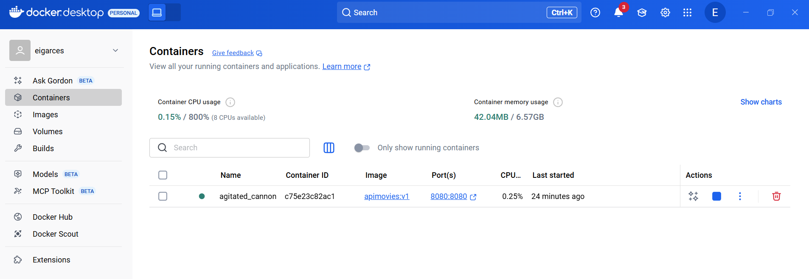
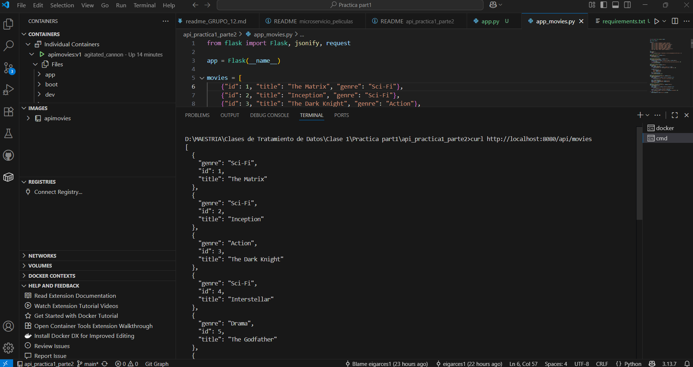
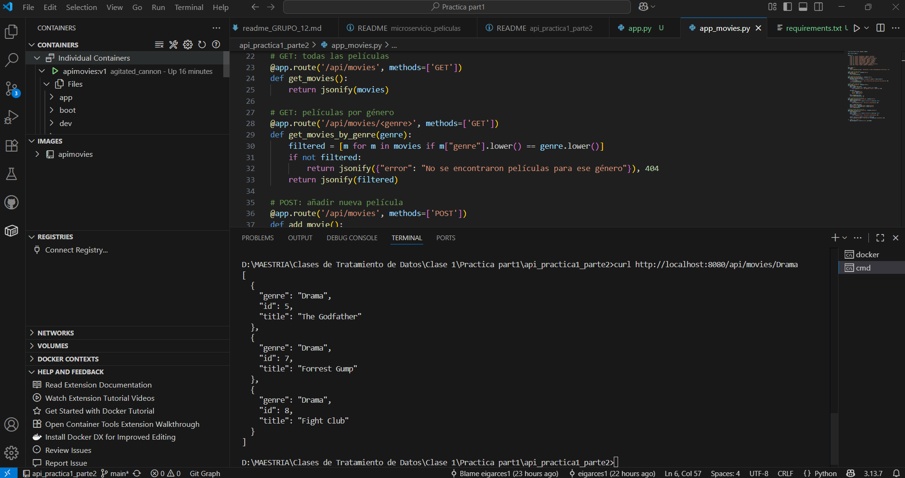
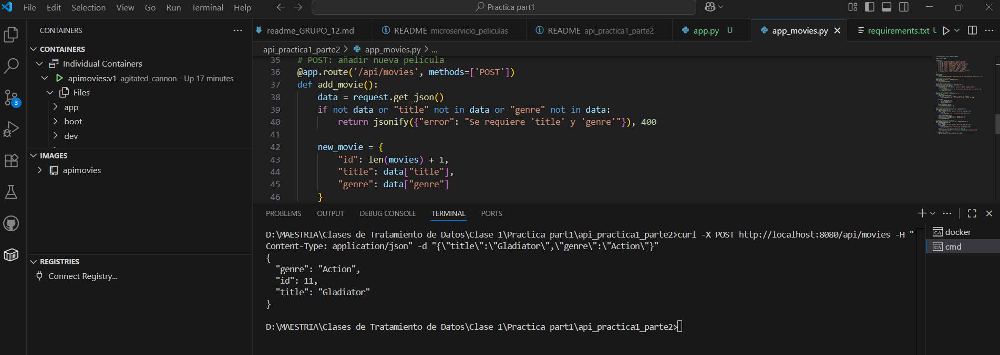
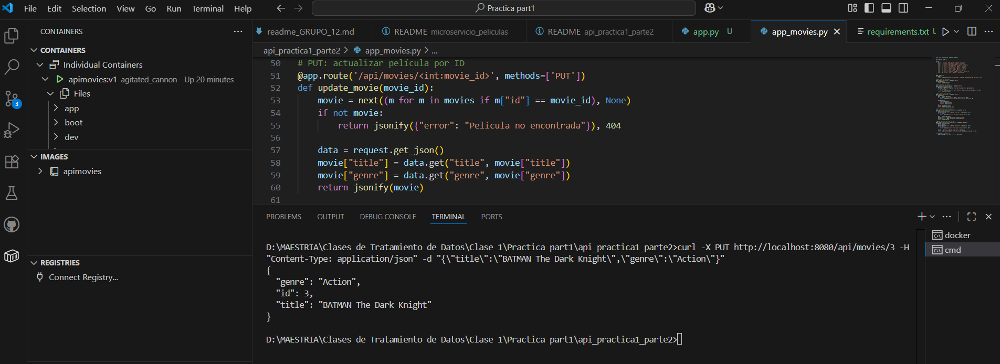
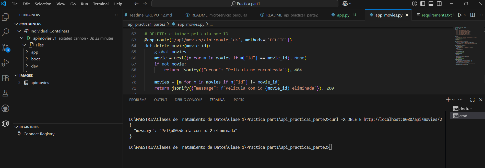
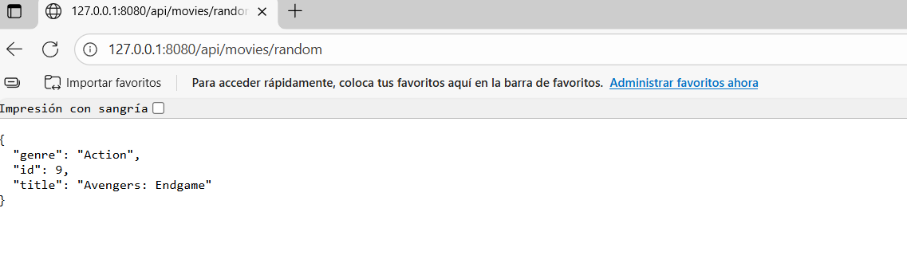

# 🎬 API Práctica #1 - Parte 2  

## API para Recomendación de Películas

Esta API recomienda películas según el género solicitado por el usuario o puede sugerir títulos aleatorios. Está diseñada para ejecutarse en un contenedor Docker y permite realizar consultas sobre una colección de películas.

---

## 🐳 Construcción y Ejecución del Contenedor en Docker

Para crear la imagen en Docker se utilizó el siguiente comando: **docker build -t apimovies:v1 .**

Para crear y ejecutar un contenedor a partir de la imagen creada se utilizó el siguiente comando: **docker run -p 8080:8080 apimovies:v1**

## 🔍 Consultas realizadas al API

🔹 **Obtener todas las películas**

- Comando: curl http://localhost:8080/api/movies

🔹 **Filtrar por género**

- Comando: curl http://localhost:8080/api/movies/Drama

🔹 **Agregar una nueva película**

- Comando: curl -X POST http://localhost:8080/api/movies -H "Content-Type: application/json" -d "{\"title\":\"Gladiator\",\"genre\":\"Action\"}" 

🔹 **Actualizar una película** (ej: id=3)

- Comando: curl -X PUT http://localhost:8080/api/movies/3 -H "Content-Type: application/json" -d "{\"title\":\"The Dark Knight Rises\",\"genre\":\"Action\"}" 

🔹 **Eliminar una película** (ej: id=10)

- Comando: curl -X DELETE http://localhost:8080/api/movies/10

## 🌐 Visualización de la API en la Web

## 🚀 Tecnologías utilizadas para la práctica
 - Python + Flask
 - Docker
 - Curl

## 📌 Recomendaciones
Asegúrase de tener Docker instalado y activo antes de construir la imagen.

